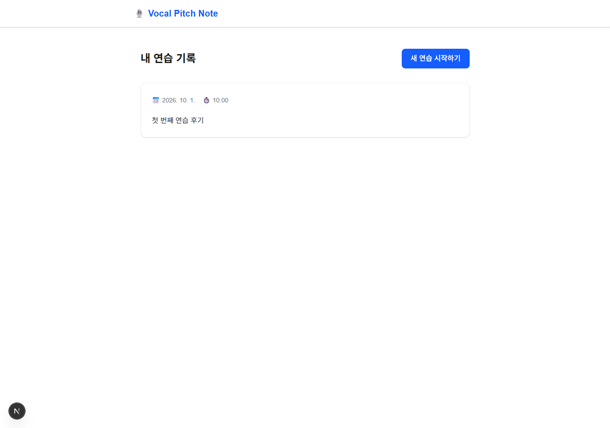
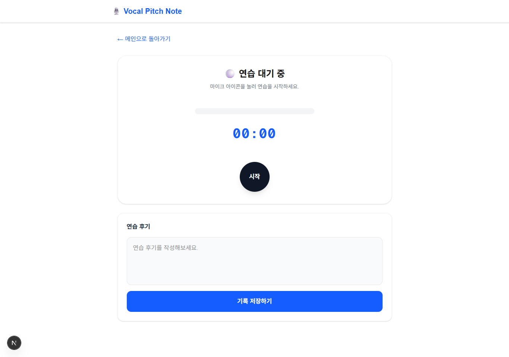
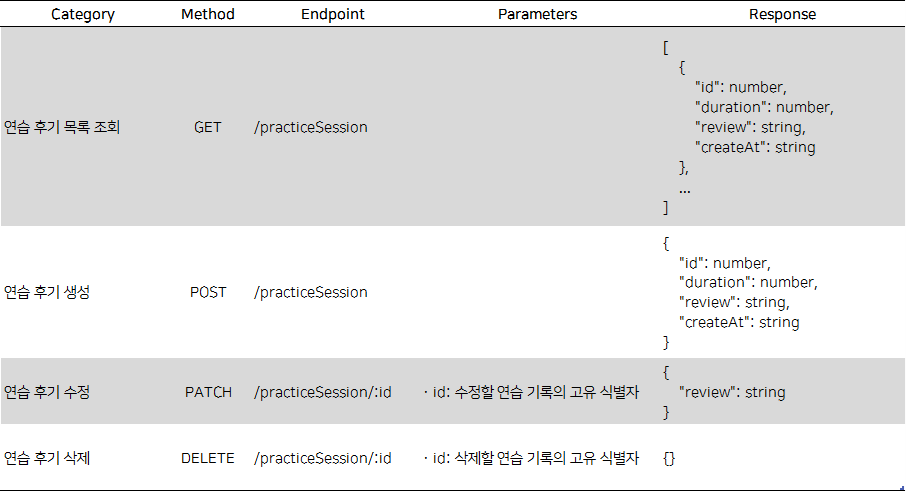

<div align="center">

# 음량과 음정을 실시간 출력하는 길잡이: VPN(Vocal Pitch Navigator)
### [SeSAC 동대문 캠퍼스] AI Full Stack 과정 4기 1차 개인 프로젝트


</div>

## 프로젝트 소개
- 개요: 노래방에서 즐기기 전에 간단히 목을 풀 수 있는 실시간 측정기
- 구성: 개인(총 1인)
- 기간: 2026.10.01.~2026.10.02.

### 서비스 화면
|메인 페이지|연습 페이지|
|:---:|:---:|
|||

### 서비스 흐름
```Mermaid
flowchart LR
    %% 스타일 정의
    classDef process fill:#eff6ff,stroke:#3b82f6,stroke-width:2px,color:#1e40af,font-weight:bold
    classDef data fill:#f0fdf4,stroke:#22c55e,stroke-width:2px,color:#166534

    subgraph 메인_페이지["# 메인 페이지"]
        목록조회:::process

    end

    subgraph 연습_페이지["[ 보컬 연습 페이지 ]"]
        대기상태:::process
        음성분석:::process
        기록저장:::data

        대기상태 -- "녹음 시작" --> 음성분석
        음성분석 -- "녹음 중지" --> 대기상태
        음성분석 -- "저장 진행" --> 기록저장
    end

    %% 전체 페이지 간의 핵심 흐름 (User Flow)
    목록조회 -- "연습 시작" --> 대기상태
    기록저장 -- "저장 완료" --> 목록조회
    대기상태 -- "연습 취소" --> 목록조회
```

## 프로젝트 설계

### 기술 스택

#### Front-End
- **Language**: `TypeScript`
- **Freamework**: `Next.JS` (App Router 방식)
- **State Management**: `React Query` (@TanStack Query)
- **Core Library**
    - **Audio Processing**: `Pitch Finder` (Browser API Based Library)

#### Back-End
- **Mock API**: JSON Server
-  **Database**: vpn-db.json(JSON Server Local DB)

### 핵심 기능
- **음성 분석**
    - `Web Audio API`와 `Pitch Finder`를 활용해 음량과 음정을 수치로 시각화
- **후기 관리**
    - `JSON Server`를 통해 DB를 설계하고 연습 후기를 작성하는 `MockAPI` 개발

### API 명세서


### 폴더 구조
```directory
📦vpn-app/                      # Next.JS의 App Router
 ├─📁app/
 │  ├─📄layout.tsx              # 전역 레이아웃
 │  ├─📄page.tsx                # 메인 페이지
 │  └─📁features/
 │     └─📁practice/
 │        └─📄page.tsx          # 연습 페이지
 │
 └─📁src/
    ├─📁common/
    │  ├─📁constants/           # 전역 변수 및 환경 변수
    │  └─📁components/          # 전역 컴포넌트
    │
    └─📁features/
       └─📁practice/
          ├─📁api/              # Mock API 기반 Router
          ├─📁components/       # 도메인 특화 컴포넌트
          │  ├─📁visualizer/    # 실시간 음량 및 음성 시각화
          │  └─📁reviewer/      # 연습 후기 작성 및 저장
          ├─📁hooks/            # 상태 관리 및 비즈니스 Hook
          ├─📁types/            # TypeScript 인터페이스 및 Type 정의
          └─📁utils/            # 유틸리티 함수 정의
```

### 실행 방법

#### 1. Next.JS 15+와 Node.JS 20+ 환경에서 호환 보장

#### 2. 환경 설정을 위해 .env 파일 설정
```bash
cd vpn-app  # 현재 위치라면 이동 생략.
cp env_template .env.local
```

##### 환경 변수
- `NEXT_PUBLIC_BACKEND_ENDPOINT_URL`: Back-End 연동을 위한 URL 주소

#### 3. Back-End 실행
```bash
cd vpn-app  # 현재 위치라면 이동 생략.
npm run dev
```

#### 4. Front-End 실행
```bash
cd vpn-app  # 현재 위치라면 이동 생략.
npm run server
```
